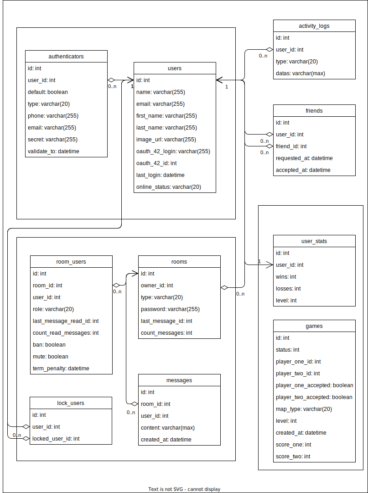

# database structure

## tables

### users

|users               |type        |description |
|--------------------|------------|------------|
|id                  |int         |id          |
|name                |varchar(255)|name of user|
|email               |varchar(255)|email of user (is not used on interface)|
|first_name          |varchar(255)|first name of user (is not used on interface)|
|last_name           |varchar(255)|last name of user (is not used on interface)|
|image_url           |varchar(255)|url of avatar|
|oauth_42_login      |varchar(255)|user login of 42 database|
|oauth_42_id         |int         |user id of 42 database|
|last_login          |datetime    |date of last login user|
|online_status       |varchar(20) |status of user can be : ONLINE, OFFLINE, HIDDEN|

### authenticators

|authenticators      |type        |description |
|--------------------|------------|------------|
|id                  |int         |id          |
|user_id             |int         |user id     |
|default             |boolean     |specify the default two way authentification system. We can be have more thats one authenticator|
|type                |varchar(20) |type of authenticator. Can be : SMS, EMAIL, APP|
|phone               |varchar(255)|phone number if the type is SMS|
|email               |varchar(255)|email if the type is EMAIL|
|secret              |varchar(255)|the secret code passed in email or sms to validate authentication|
|validate_to         |datetime    |the secret duration validity|

### friends

|friends             |type        |description |
|--------------------|------------|------------|
|id                  |int         |id          |
|user_id             |int         |user id     |
|friend_id           |int         |user id of friend|
|requested_at        |datetime    |date of requested friendship|
|accepted_at         |datetime    |date of accepted friendship|

### user_stats

|user_stats          |type        |description |
|--------------------|------------|------------|
|id                  |int         |id          |
|user_id             |int         |user id     |
|wins                |int         |how many times the user has won|
|losses              |int         |how many times the user has loss|
|level               |int         |make some level of user (I still have no idea about that)|

### activity_logs

|activity_logs       |type        |description |
|--------------------|------------|------------|
|id                  |int         |id          |
|user_id             |int         |user id     |
|type                |varchar(20) |type of activity. Can be : LOGIN, LOGOUT, CREATE_ROOM, UPDATE_ROOM (the list is not exhaustive)|
|datas               |varchar(max)|a json structure that contain the detail of activity|

### rooms

|rooms               |type        |description |
|--------------------|------------|------------|
|id                  |int         |id          |
|owner_id            |int         |the owner of room. User id|
|type                |varchar(20) |type of room. Can be : PUBLIC_ROOM, SINGLE_CHAT|
|password            |varchar(255)|password of room if is protected. To determine if the room is protected, we check if password is NULL or not NULL.|
|last_message_id     |int         |id of last message in room|
|count_messages      |int         |number of message in room|

### messages

|messages            |type        |description |
|--------------------|------------|------------|
|id                  |int         |id          |
|room_id             |int         |the id of room|
|user_id             |int         |user id     |
|content             |varchar(max)|the text in message|
|created_at          |datetime    |date of creation|

### room_users

|room_users          |type        |description |
|--------------------|------------|------------|
|id                  |int         |id          |
|room_id             |int         |the id of room|
|user_id             |int         |user id     |
|role                |varchar(20) |the role of user. Can be : ADMIN, USER|
|last_message_read_id|int         |id of last message readed by user in this room. It’s used to start the conversation to the last unread message.|
|count_read_messages |int         |number of message readed in this room. It’s used to count how many message you have not read.|
|ban                 |boolean     |if user is banned.|
|mute                |boolean     |if user is mutted.|
|term_penalty        |datetime    |the duration of the penalty of mute or ban|

### lock_users

|lock_users          |type        |description |
|--------------------|------------|------------|
|id                  |int         |id          |
|user_id             |int         |user id     |
|locked_user_id      |int         |user id of user locked|

### games

|games               |type        |description |
|--------------------|------------|------------|
|id                  |int         |id          |
|status              |int         |status of game : CREATED, STARTED, FINISHED|
|player_one_id       |int         |user id of player on|
|player_two_id       |int         |user id of player two|
|player_one_accepted |boolean     |player one is ready to play|
|player_two_accepted |boolean     |player two is ready to play|
|map_type            |varchar(20) |type of map. Can be : STANDARD, BLACKHOLE|
|level               |int         |the level of game (I still have no idea about that)|
|created_at          |datetime    |date of creation|
|score_one           |int         |score of player one|
|score_two           |int         |score of player two|
